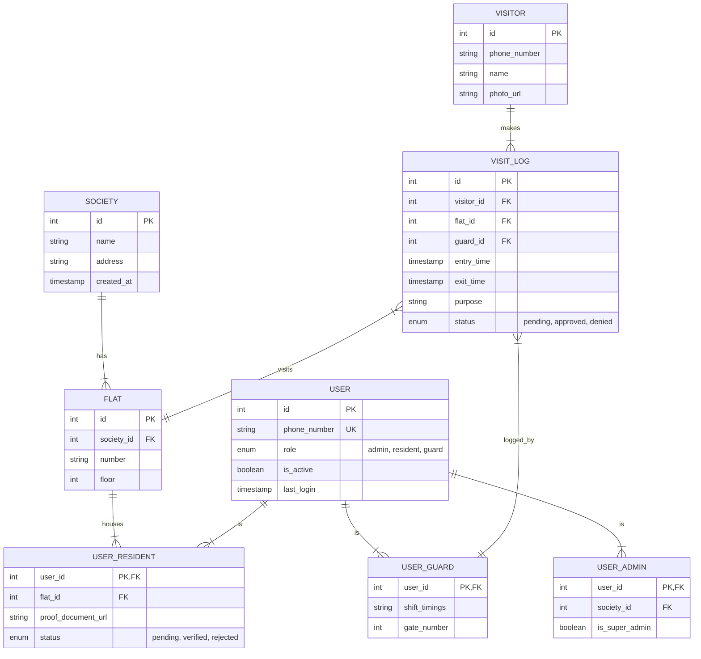

# Entity Relationship (ER) Diagram

```mermaid
erDiagram
    SOCIETY ||--|{ FLAT : "has"
    SOCIETY {
        int id PK
        string name
        string address
        timestamp created_at
    }

    FLAT ||--|{ USER_RESIDENT : "houses"
    FLAT {
        int id PK
        int society_id FK
        string number
        int floor
    }

    USER ||--|{ USER_RESIDENT : "is"
    USER ||--|{ USER_GUARD : "is"
    USER ||--|{ USER_ADMIN : "is"
    
    USER {
        int id PK
        string phone_number UK
        enum role "admin, resident, guard"
        boolean is_active
        timestamp last_login
    }

    USER_RESIDENT {
        int user_id PK, FK
        int flat_id FK
        string proof_document_url
        enum status "pending, verified, rejected"
    }

    USER_GUARD {
        int user_id PK, FK
        string shift_timings
        int gate_number
    }

    USER_ADMIN {
        int user_id PK, FK
        int society_id FK
        boolean is_super_admin
    }

    VISITOR ||--|{ VISIT_LOG : "makes"
    VISITOR {
        int id PK
        string phone_number
        string name
        string photo_url
    }

    VISIT_LOG }|--|| FLAT : "visits"
    VISIT_LOG }|--|| USER_GUARD : "logged_by"
    VISIT_LOG {
        int id PK
        int visitor_id FK
        int flat_id FK
        int guard_id FK
        timestamp entry_time
        timestamp exit_time
        string purpose
        enum status "pending, approved, denied"
    }
```
