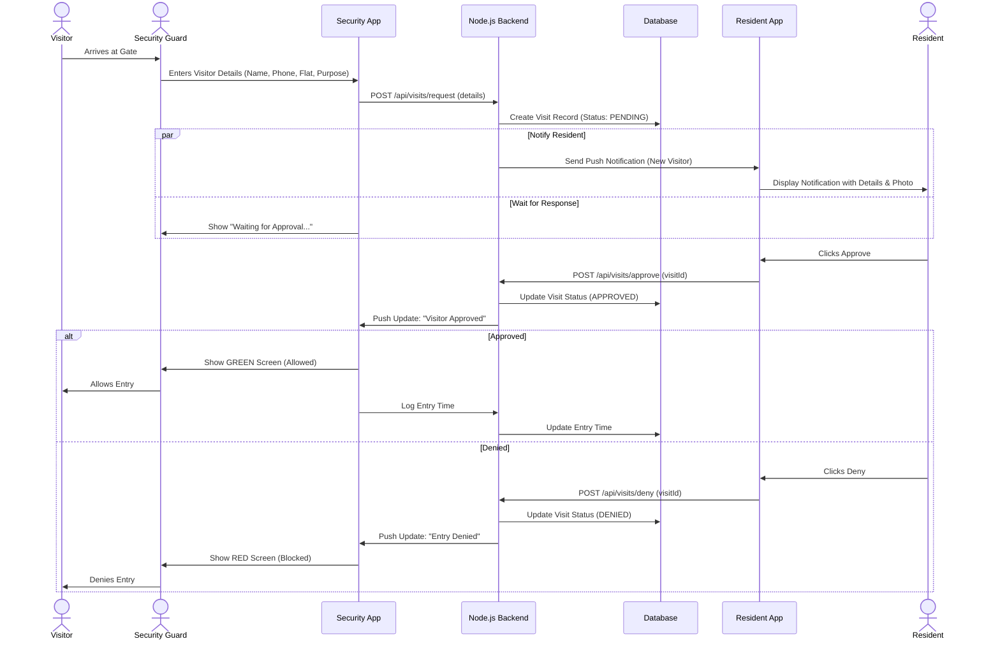

# Sequence Diagram: Visitor Arrival Flow

```mermaid
sequenceDiagram
    actor Visitor
    actor Guard as Security Guard
    participant GuardApp as Security App
    participant Backend as Node.js Backend
    participant DB as Database
    participant ResidentApp as Resident App
    actor Resident

    Visitor->>Guard: Arrives at Gate
    Guard->>GuardApp: Enters Visitor Details (Name, Phone, Flat, Purpose)
    GuardApp->>Backend: POST /api/visits/request (details)
    Backend->>DB: Create Visit Record (Status: PENDING)
    
    par Notify Resident
        Backend->>ResidentApp: Send Push Notification (New Visitor)
        ResidentApp->>Resident: Display Notification with Details & Photo
    and Wait for Response
        GuardApp->>Guard: Show "Waiting for Approval..."
    end

    Resident->>ResidentApp: Clicks Approve
    ResidentApp->>Backend: POST /api/visits/approve (visitId)
    Backend->>DB: Update Visit Status (APPROVED)
    
    Backend->>GuardApp: Push Update: "Visitor Approved"
    
    alt Approved
        GuardApp->>Guard: Show GREEN Screen (Allowed)
        Guard->>Visitor: Allows Entry
        GuardApp->>Backend: Log Entry Time
        Backend->>DB: Update Entry Time
    else Denied
        Resident->>ResidentApp: Clicks Deny
        ResidentApp->>Backend: POST /api/visits/deny (visitId)
        Backend->>DB: Update Visit Status (DENIED)
        Backend->>GuardApp: Push Update: "Entry Denied"
        GuardApp->>Guard: Show RED Screen (Blocked)
        Guard->>Visitor: Denies Entry
    end
```
